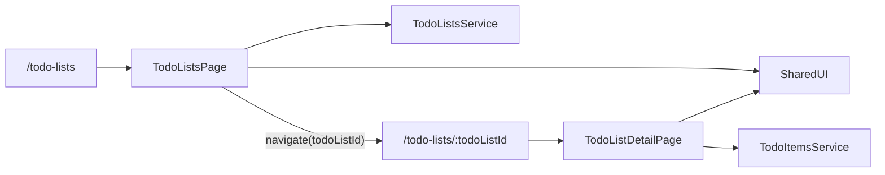

# Plan Fase 2: Multi-Lista y Calidad

## Objetivo

Extender la app actual para soportar `todo-lists` como recurso de primer nivel y `todo-items` como detalle por lista, manteniendo la arquitectura modular ya creada y elevando la calidad con mejor UX/UI, accesibilidad y testing formal.

## Decisiones clave

- La navegación principal pasará a:
  - `/todo-lists` para el CRUD de listas
  - `/todo-lists/:todoListId` para el CRUD de items de una lista
- Se reutilizará el contrato real del backend:
  - `TodoList { id, name, todoItems }`
  - `TodoItem { id, name, description?, done }`
- La recomendación UX será:
  - creación inline en cada pantalla
  - edición en modal reutilizable
  - borrado con acción explícita y feedback visual
- `React Query` seguirá siendo la capa de estado servidor, pero con query keys por colección y por `todoListId`.
- Se mantendrá `VITE_API_URL=http://localhost:4000/api`.

## Arquitectura objetivo

## Estructura propuesta

- `frontend/src/app/`
  - router con rutas de colección y detalle
  - layout base con navegación contextual
- `frontend/src/shared/`
  - componentes reusables existentes
  - nuevos componentes si hacen falta: `Modal`, `Field`, `Textarea`, `EmptyState`, `Spinner`, `PageHeader`, `IconButton`
  - utilidades de accesibilidad y helpers de testing
- `frontend/src/modules/todo-list/`
  - separación explícita entre pantalla de listas y pantalla de detalle
  - hooks de queries/mutations por recurso
  - servicios con CRUD completo de listas e items
  - tipos de request/response alineados al backend

## Contrato API a consumir

- Base URL frontend: `VITE_API_URL=http://localhost:4000/api`
- `todo-lists`
  - `GET /todo-lists`
  - `POST /todo-lists` body: `{ name: string }`
  - `GET /todo-lists/:todoListId`
  - `PUT /todo-lists/:todoListId` body: `{ name?: string }`
  - `DELETE /todo-lists/:todoListId`
- `todo-items`
  - `GET /todo-lists/:todoListId/todo-items`
  - `POST /todo-lists/:todoListId/todo-items` body: `{ name: string, description?: string }`
  - `GET /todo-lists/:todoListId/todo-items/:todoItemId`
  - `PUT /todo-lists/:todoListId/todo-items/:todoItemId` body: `{ name?: string, description?: string, done?: boolean }`
  - `DELETE /todo-lists/:todoListId/todo-items/:todoItemId`

## Trabajo a realizar

1. Refactorizar el routing y la navegación del módulo.
   - Actualizar `frontend/src/app/router/AppRouter.tsx` para soportar `/todo-lists` y `/todo-lists/:todoListId`.
   - Separar la pantalla actual de items en una página de detalle real por id.
   - Añadir navegación de regreso desde detalle hacia la colección.
2. Reestructurar el módulo `todo-list` para soportar dos vistas.
   - Crear una pantalla `TodoListsPage` para obtener, crear, editar y borrar listas.
   - Refactorizar la actual `TodoListPage` para usar `todoListId` desde la URL y soportar obtener lista por id más CRUD de items.
   - Ajustar hooks y query keys para manejar colección y detalle sin acoplarse a “la primera lista”.
3. Completar los servicios y tipos según backend.
   - Extender `frontend/src/modules/todo-list/services/todoList.service.ts` con:
     - `getTodoListById`
     - `updateTodoList`
     - `deleteTodoList`
     - `getTodoItems`
     - `getTodoItemById`
   - Extender `frontend/src/modules/todo-list/types/todo.types.ts` con types de request/response para create y update de listas e items.
4. Extender la librería shared para un CRUD senior.
   - Reutilizar `Button`, `Input`, `Checkbox`, `Icon` y `Layout`.
   - Agregar solo los componentes que hagan falta para una UX limpia:
     - `Modal` para editar
     - `Field` o `FormField` para label, help text y error
     - `Textarea` para descripción
     - `EmptyState`, `Spinner` y `PageHeader`
   - Mantener un type propio por componente compartido.
5. Mejorar la experiencia UI/UX.
   - Hacer la UI fully responsive con layouts de una y dos columnas según viewport.
   - Añadir estados claros de carga, error, vacío y éxito.
   - Priorizar accesibilidad:
     - labels reales
     - roles semánticos
     - foco visible
     - navegación completa por teclado
     - `aria-*` en botones de acción, diálogos y controles
6. Configurar testing con Jest + React Testing Library.
   - Añadir `jest`, `ts-jest`, `jest-environment-jsdom`, `@testing-library/react`, `@testing-library/jest-dom` y `@testing-library/user-event`.
   - Crear `jest.config` y `setupTests`.
   - Añadir snapshots para shared components presentacionales.
   - Cubrir:
     - renders y accesibilidad de shared UI
     - navegación y flujos CRUD de ambas pantallas
     - hooks/mutations con mocks de API
   - Apuntar a cobertura del 100% en líneas, ramas, funciones y statements.
7. Validación final.
   - Ejecutar lint, tests con coverage y build.
   - Verificar manualmente ambos flows:
     - CRUD completo de listas en `/todo-lists`
     - CRUD completo de items en `/todo-lists/:todoListId`

## Archivos más relevantes

- Frontend actual a extender:
  - `frontend/src/app/router/AppRouter.tsx`
  - `frontend/src/app/layouts/AppLayout.tsx`
  - `frontend/src/modules/todo-list/pages/TodoListPage.tsx`
  - `frontend/src/modules/todo-list/hooks/useTodoList.ts`
  - `frontend/src/modules/todo-list/services/todoList.service.ts`
  - `frontend/src/modules/todo-list/types/todo.types.ts`
  - `frontend/src/shared/components/`
  - `frontend/package.json`
- Backend de referencia:
  - `backend/src/todo-lists/todo-lists.controller.ts`
  - `backend/src/todo-lists/todo-lists.service.ts`
  - `backend/src/todo-lists/dtos/create-todo-list.dto.ts`
  - `backend/src/todo-lists/dtos/update-todo-list.dto.ts`
  - `backend/src/todo-lists/dtos/add-todo-item.dto.ts`
  - `backend/src/todo-lists/dtos/update-todo-item.dto.ts`

## Riesgos a vigilar

- El backend usa `PUT` y no `PATCH`; el frontend debe enviar bodies válidos y no asumir partial update inseguro para listas.
- `GET /todo-lists` ya devuelve `todoItems`; conviene decidir cuándo usar detalle embebido vs endpoint específico de items para evitar fetches redundantes.
- La meta de `100%` de cobertura puede requerir desacoplar lógica de UI y mockear correctamente React Router, React Query y `fetch`.
- La mejora visual no debe romper la simplicidad del wireframe original ni la consistencia con los shared components.
